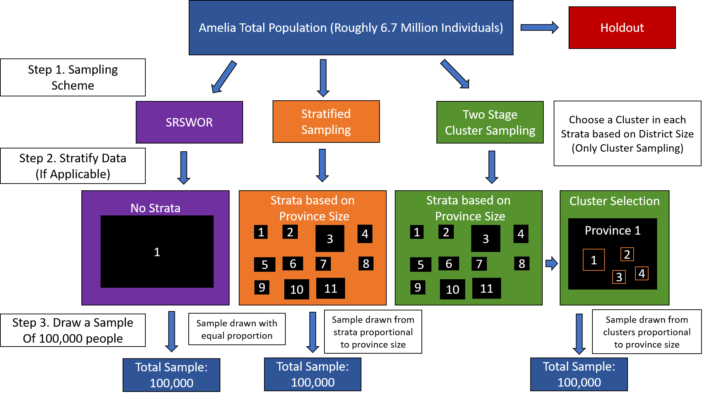
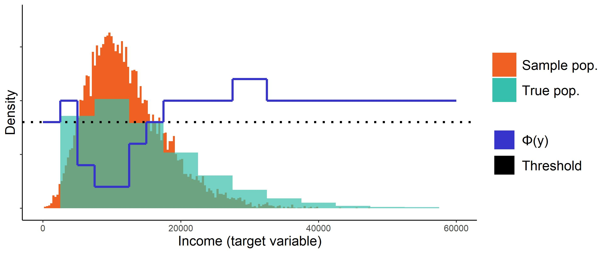

# Effects of Complex Sampling and correction methods in Machine Learning Applications
## Research Case Studies, Trier University, Winter semester 2021/2022

The goals of this research case study are to

1. Evaluate the impact of complex sampling methods on ML models in regression context
2. Apply sampling correction techniques to evaluate predictive quality of ML models
3. Compare predictive power of ML models using different smapling and correction techniques

All in all, the process model will look like this: 

We will be using the AMELIA dataset and perform an income prediction with the goal of determining poverty rates. AMELIA is an open source data set provided by the University of Trier. To access the dataset visit http://amelia.uni-trier.de/?p=287.

## Sampling methods

We will use complex sampling methods to draw samples of N = 100,000 on which we will train the models. The complex sampling methods we're going to implement are: 

1. Simple Random Sampling: Baseline method
2. Stratified Sampling using proportional allocation
3. Stratified Cluster Sampling using proportional allocation

All sampling methods will be done without replacement. Additionally, we draw a holdout sample from the full AMELIA population which will be excluded prior to sampling and used later on to evaluate and compare the performance of all models on this subset of the data. By removing the holdout sample prior to doing our sampling of the training data we can ensure that all the models have not seen the data before, which allows us to compare the performance across all models using the same dataset. This method of evaluation has e.g. been proposed by [Raschka, 2018](https://arxiv.org/abs/1811.12808).

## Sampling Correction methods

The correction methods we are going to implement are based on Utility-Based Learning. We will specify a relevance function to assign a non-uniform relevance to each example in our training data. We can then use this relevance to perform over- and undersampling. The methods we are going to implement are: 

1. No correction: Baseline method
2. Importance Sampling
3. Smote for Regression (based on [Torgo et al., 2013](https://doi.org/10.1007/978-3-642-40669-0_3))

To specify the relevance of each example, we assume some knowledge about the distribution of our target variable, i.e. the income distribution in buckets of 5,000$. An examplary relevance function based on the difference between the true and the sampled income distribution could e.g. look like this: 

## Machine learning models

Since we are dealing with a prediction task, we will be using regression models. The models we plan on implementing are: 

1. Linear Regression: Baseline method
2. Random Forest Regression
3. Neural Network Regression 

## Evaluation metrics

In addition to using our holdout sample to get comparable metrics on model performance, we also plan on evaluating the ability of our models in estimating the true population parameters (e.g. mean, median, variance).
